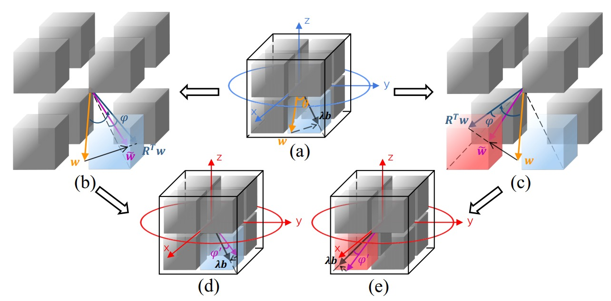

# Rotated Binary Neural Network (Paper Coming).

Pytorch implementation of RBNN (NeurIPS 2020).

<div align=center></div>


## Dependencies 
* Python 3.7
* Pytorch == 1.1.0 


## Tips

We encourage the readers to have a look at the materials of [reviewers' comments](https://github.com/lmbxmu/RBNN/blob/master/RBNN_reviewer_comment.pdf) and [authors' responses](https://github.com/lmbxmu/RBNN/blob/master/RBNN_author_response.pdf) which might explain your potential questions w.r.t. our paper. Any problem beyond that, please contact the first author (lmbxmu@stu.xmu.edu.cn or linmb007 if you are using wechat) or the third author (ianhsu@stu.xmu.edu.cn). Also, you can post issues with github, but sometimes we could not receive github emails thus may ignore the posted issues (sorry if it happens).


## Citation
If you find RBNN useful in your research, please consider citing:
```
@inproceedings{lin2020rotated,
  title={Rotated Binary Neural Network},
  author={Lin, Mingbao and Ji, Rongrong and Xu, Zihan and Zhang, Baochang and Wang, Yan and Wu, Yongjian and Huang, Feiyue and Lin, Chia-Wen},
  booktitle={Proceedings of the Advances in Neural Information Processing Systems (NeurIPS)},
  year={2020}
}
```


## Training on CIFAR-10
```bash
python -u main.py \
--gpus 0 \
--model resnet20_bireal_1w1a (or resnet20_1w1a or resnet18_1w1a or vgg_small_1w1a) \
--results_dir ./result \
--data_path [DATA_PATH] \
--dataset cifar10 \
--epochs 1000 \
--lr 0.1 \
-b 256 \
-bt 128 \
--Tmin 1e-2 \
--Tmax 1e1 \
--lr_type cos \
--warm_up \
```
### Optional arguments
```
optinal arguments:
    --results_dir             Path to save directory  
    --save                    Path to save folder    
    --resume                  Reload last checkpoint if the training is terminated by accident.
    --evaluate / -e           Evaluate  
    --model / -a              Choose model   
                              default: resnet20_bireal_1w1a   
                              options: resnet20_1w1a / resnet18_1w1a / vgg_small_1w1a       
    --dataset                 Choose dataset
                              default: cifar10
                              options: cifar100 / tinyimagenet / imagenet  
    --data_path               Path to dataset    
    --gpus                    Specify gpus, e.g., 0, 1  
    --lr                      Learning rate
                              default: 0.1  
    --weight_decay            Weight decay
                              default: 1e-4  
    --momentum                Momentum
                              default: 0.9  
    --workers                 Data loading workers
                              default: 8  
    --epochs                  Number of training epochs
                              default:1000  
    --batch_size / -b         Batch size
                              default: 256   
    --batch_size_test / -bt   Evaluating batch size
                              default: 128  
    --print_freq              Print frequency 
                              default: 100  
    --time_estimate           Estimate finish time of the progra
                              set to 0 to disable
                              default: 1     
    --rotation_update         Update rotaion matrix every n epoch
                              default: 1   
    --Tmin                    Minimum of param T in gradient approximation function
                              default: 1e-2  
    --Tmax                    Maximum of param T in gradient approximation function
                              default: 1e1  
    --lr_type                 Type of learning rate scheduler
                              default: cos (CosineAnnealingLR)
                              options: step (MultiStepLR)  
    --lr_decay_step           If choose MultiStepLR, set milestones.
                              e.g., 30 60 90    
    --a32                     Don't binarize activation, namely w1a32    
    --warm_up                 Use warm up  
```
### Results on CIFAR-10.

| batch_size | batch_size_test | epochs| Top-1 |Quantized model Link | Paper data|
|:----------:|:---------------:|:-----:|:-----:|:-------------------:|:---------:|
|   256      |  128            | 1,000 | 92.2% |[resnet18_1w1a](https://drive.google.com/drive/folders/1dABYp66jArFjTQxodpDZ88KCLdGSraY0?usp=sharing)| ✔ | 
|   256      |  128            | 1,000 | 86.5% |[resnet20_1w1a](https://drive.google.com/drive/folders/1aykx5Kar2Y-8mYf13LqvThdTuSlkgtmQ?usp=sharing)| ✔ | 
|   256      |  128            | 1,000 | 87.8% |[resnet20_bireal_1w1a](https://drive.google.com/drive/folders/1kwZAe0Ock4CptEuAjxs4ENrrv9jrXULm?usp=sharing)| ✔ | 
|   256      |  128            | 1,000 | 91.3% |[vgg_small_1w1a](https://drive.google.com/drive/folders/16GsXmzVoFkZMrIbPyKdArgpMutr1Gtca?usp=sharing)| ✔ | 

To ensure the reproducibility, please refer to our training details provided in the links for our quantized models. \
If it takes too much time to finish a total of 1,000 epochs on your platform, you can consider 400 epochs instead. It can feed back impressive performance as well, better than the compared methods in the paper.

To verify the performance of our quantized models on CIFAR-10, please use the following command:
```bash 
python -u main.py \
--gpus 0 \
-e [best_model_path] \
--model resnet20_bireal_1w1a (or resnet20_1w1a or resnet18_1w1a or vgg_small_1w1a) \
--data_path [DATA_PATH] \
--dataset cifar10 \
-bt 128 \
```


## Training on ImageNet
```bash
python -u main.py \
--gpus 0,1,2,3 \
--model resnet18_1w1a (or resnet34_1w1a) \
--results_dir ./result \
--data_path [DATA_PATH] \
--dataset imagenet \
--epochs 150 \
--lr 0.1 \
-b 512 \
-bt 256 \
--Tmin 1e-2 \
--Tmax 1e1 \
--lr_type cos \
--use_dali \
```   
Other arguments are the same as those on CIFAR-10   
```
optinal arguments:
    --model / -a        Choose model  
                        default: resnet18_1w1a.   
                        options: resnet34_1w1a   
```  

We provide two types of dataloaders by [nvidia-dali](https://docs.nvidia.com/deeplearning/dali/user-guide/docs/index.html) and [Pytorch](https://pytorch.org/docs/stable/data.html) respectively. They use the same data augmentations, including random crop and horizontal flip. We empirically find that the dataloader by Pytorch can offer a better accuracy performance. They may have different code implementations. Anyway, we haven't figured it out yet. However, nvidia-dali shows its extreme efficiency in processing data which well accelerates the network training. The reported experimental results are on the basis of nvidia-dali due to the very limited time in preparation of NeurIPS submission. If interested, you can try dataloader by Pytorch via removing the optional argument ```--use_dali``` to obtain a better performance.
 
 \
nvidia-dali package
```
# for cuda9.0
pip install --extra-index-url https://developer.download.nvidia.com/compute/redist/cuda/9.0 nvidia-dali
# for cuda10.0
pip install --extra-index-url https://developer.download.nvidia.com/compute/redist/cuda/10.0 nvidia-dali
```


### Results on ImageNet.

| batch_size | batch_size_test | epochs| use_dali| Top-1| Top-5 |Quantized model Link | Paper data|
|:----------:|:---------------:|:-----:|:-------:|:----:|:-----:|:-------------------:|:---------:|
|   256      |  256            |  120  | Yes     |58.8% | 80.9% |[resnet18_1w1a](https://drive.google.com/drive/folders/1Gr6mGDOTqKYipq6kstBbxiFWbvVZ_lWE?usp=sharing)| ✘ | 
<<<<<<< HEAD
|   512      |  256            |  120  | Yes     |59.6% | 81.6% |[resnet18_1w1a](https://drive.google.com/drive/folders/1xccbtWqm0x8ZF8FVh9wDlhiZmteanGnC?usp=sharing)| ✔ | 
|   512      |  256            |  150  | Yes     |59.9% | 81.9% |[resnet18_1w1a](https://drive.google.com/drive/folders/14jxaB8SwohsxYXJdjQJERw80IQVV7-Ll?usp=sharing)| ✘ | 
|   512      |  256            |  150  | Yes     |63.1% | 84.4% |[resnet34_1w1a](https://drive.google.com/drive/folders/18IxJlYp4i032188hfE3ETJOKH4WxgffF?usp=sharing)| ✘ |
|   512      |  256            |  200  | Yes     |63.5% | 84.6% |[resnet34_1w1a](https://drive.google.com/drive/folders/1R7uz2he4itmwpH026KsVJvs6oWP4iaB8?usp=sharing)| ✔ |
=======
|   512      |  256            |  120  | Yes     |59.6% | 81.6% |[resnet18_1w1a](https://drive.google.com/drive/folders/1xccbtWqm0x8ZF8FVh9wDlhiZmteanGnC?usp=sharing)| ✘ | 
|   512      |  256            |  150  | Yes     |59.9% | 81.9% |[resnet18_1w1a](https://drive.google.com/drive/folders/14jxaB8SwohsxYXJdjQJERw80IQVV7-Ll?usp=sharing)| ✔ | 
|   512      |  256            |  150  | Yes     |63.1% | 84.4% |[resnet34_1w1a](https://drive.google.com/drive/folders/18IxJlYp4i032188hfE3ETJOKH4WxgffF?usp=sharing)| ✔ |
>>>>>>> c2acd65c21a5b2437c0826a70ce968c9af8cd0bc

To ensure the reproducibility, please refer to our training details provided in the links for our quantized models. \
Small tips for further boosting the performance of our method: (1) removing the optional argument ```--use_dali``` as discussed above; (2) increasing the training epochs (200 for example, as adopted in most existing works for binary neural network); (3) enlarging the batch size for training (2048 for example if you have a powerful platform, as done in some existing works). 

To verify the performance of our quantized models on ImageNet, please use the following command:
```bash
python -u main.py \
--gpu 0 \
-e [best_model_path] \
--model resnet18_1w1a (or resnet34_1w1a)\
--dataset imagenet \
--data_path [DATA_PATH] \
-bt 256
```
